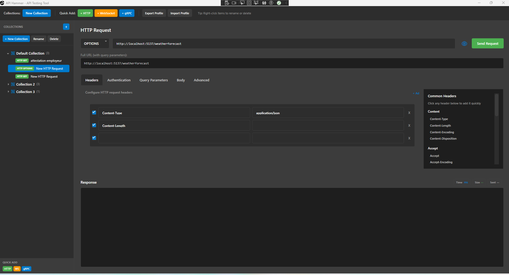
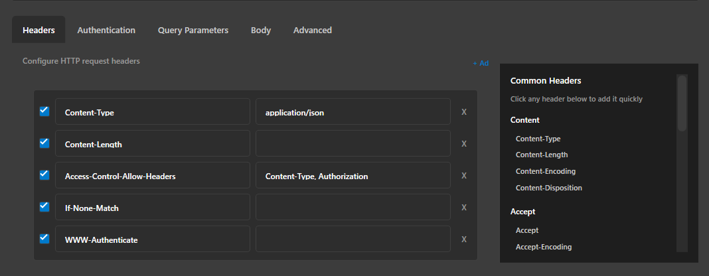

# APIHammer

A modern, lightweight, developer-friendly HTTP client and API testing tool built with WPF (.NET 9). Designed for fast exploratory testing, batch execution, and productivity.

## Key Features

- Intuitive tabbed interface for multiple requests
- Streaming response display (see headers/body as they arrive)
- Advanced HTTP settings (timeout, max capture size, JSON formatting toggle)
- Custom headers & quick-add header suggestions
- Query parameter editor with auto new-row behavior
- Authentication support:
  - Basic Auth
  - Bearer Token
  - API Key (custom header)
- Request body editor (raw)
- Response metadata (time, size, timestamp)
- Save full response as text or body as JSON
- Copy response to clipboard
- Request preview dialog (view full composed request)
- Batch execution (send an entire collection of tabs)
- MVVM architecture with clean separation of concerns

## Recent Enhancements

| Enhancement | Description |
|-------------|-------------|
| Advanced Tab | Added per-request timeout, max capture size (MB), and JSON pretty-print toggle |
| Streaming Service | Responses processed incrementally to avoid large memory allocations |
| MVVM Refactor | View logic separated into ViewModel + behaviors (see `MVVM_Refactoring_Summary.md`) |
| Truncation Safeguards | Large responses truncated in UI while preserving full capture within configured limits |

## Screenshots

> Place your captured images in `docs/images/` (create folder if missing). Use PNG for clarity. Filenames below are suggestions.

| View | Image | Description |
|------|-------|-------------|
| Main Request UI |  | Base layout with method, URL, headers & response panel |
| Headers + Suggestions |  | Header editor with quick-add list |
| Authentication |  | Basic, Bearer, API Key examples |
| Query Parameters |  | Dynamic query parameter rows |
| Body Editing |  | Raw body editor (JSON example) |
| Advanced Settings |  | Timeout, capture size, pretty-print toggles |
| Streaming Response |  | Incremental response rendering |
| Batch Progress |  | Batch execution progress dialog |

(Optional) Add an animated GIF demonstrating a full request lifecycle:
```

```

## Usage

1. Launch the application
2. Add a new request tab (default GET)
3. Enter the base URL
4. (Optional) Add headers, query parameters, body, or authentication
5. Click Send (or press the Send button again to cancel)
6. View streaming response and metadata
7. Save or copy response as needed

### Keyboard Shortcuts

| Shortcut | Action |
|----------|--------|
| Ctrl + S | Save full response as text |
| Ctrl + J | Save response body as JSON |
| Ctrl + C | Copy response |

## Advanced Settings

Accessible via the Advanced tab:

| Setting | Description |
|---------|-------------|
| Timeout (seconds) | Per-request timeout (blank or 0 = infinite) |
| Max Capture Size (MB) | Limits how much of the response body is stored in memory |
| Pretty Print JSON | Formats JSON responses when small enough |

## Batch Execution

The batch system allows sending every request in a collection sequentially.

Features:
- Progress tracking (current index / total)
- Per-request status text
- Elapsed time counter
- Cancellation support
- Result summary with success/failure counts

## Architecture

- UI: WPF (XAML) with dark theme styling
- Pattern: MVVM
- Commands: Custom RelayCommand & AsyncRelayCommand
- Behaviors: Focus handling + PasswordBox binding
- Services:
  - `HttpRequestService` – streaming + formatting + truncation logic
  - `BatchRequestService` – orchestrated collection execution
- Models: `HttpRequest`, `AuthenticationSettings`, `HttpHeaderItem`, etc.

See: `MVVM_Refactoring_Summary.md` for detailed refactor notes.

## Extensibility Roadmap

Planned / candidate features (not yet implemented):
- Environment variables & value substitution (e.g. `{{baseUrl}}`)
- Cookie jar with resend options
- Multipart form-data builder
- Response diffing & history explorer
- Import/export collection format
- cURL import/export
- GraphQL & WebSocket support
- Retry policies and proxy settings
- Large file download to disk with progress

## Building

Prerequisites:
- .NET 9 SDK
- Visual Studio 2022 (latest) or VS Code with C# Dev Kit

Steps:
```
# Clone
git clone https://github.com/hamdiChehdi/APIHammer
cd APIHammer

# Build
dotnet build

# Run
cd APIHammerUI
dotnet run
```

## Contributing

Contributions welcome! Suggested workflow:
1. Fork repository
2. Create a feature branch
3. Keep changes focused & documented
4. Open a pull request with clear description

Please run a full build and test manually before submitting.

## Coding Guidelines
- Follow MVVM conventions (no business logic in code-behind)
- Keep UI responsive (async/await, no blocking calls)
- Avoid unbounded memory usage (respect capture limits)
- Use descriptive names & small focused methods

## License
_Currently unspecified – please add a LICENSE file if you intend to open source usage._

## Acknowledgments
- Inspired by tools like Postman / Insomnia, but optimized for lightweight desktop usage.

---
Have a feature request? Open an issue or start a discussion.
